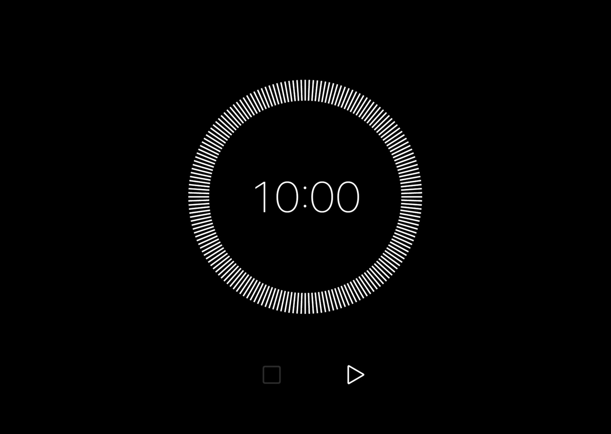
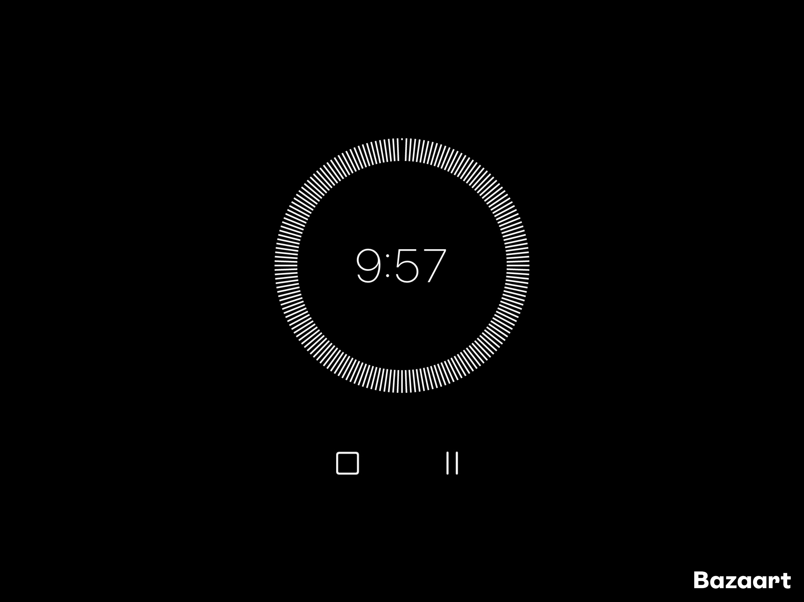

# Minimal Meditation Timer App

This is a responsive web app built using Vanilla JavaScript and Node.js. The app features a minimal Black/White UI designed to provide a clean and distraction-free environment for meditation sessions. It includes essential features like setting a countdown timer, starting, pausing, and resetting the timer, all while maintaining clean, testable code.

## Features

- **Responsive design**: Mobile-friendly layout that adapts to different screen sizes.
- **Timer**: Set a custom countdown timer and track the remaining time.
- **Start/Pause**: Start or pause the countdown at any time.
- **Reset**: Reset the timer to its initial value.
- **Minimal UI**: Black/white color scheme with a circular timer display.
- **Testable Code**: The code follows clean coding principles and is written to be easily testable.

## Installation

1. Clone the repository:
    
    ```bash
    git clone <repository_url>
    
    ```
    
2. Navigate to the project folder:
    
    ```bash
    cd minimal-meditation-timer
    
    ```
    
3. Install dependencies (if any, for example if using a bundler):
    
    ```bash
    npm install
    
    ```
    
4. Start the application locally (if using Node.js for serving the app):
    
    ```bash
    node server.js
    
    ```
    

## Usage

- **Set Time**: Use the input to set a custom countdown time.
- **Start/Pause Timer**: Press the play/pause button to start or pause the timer.
- **Reset Timer**: Press the reset button to reset the timer to the initial time.

### Keyboard Shortcuts

- `Space`: Start/Pause the timer.
- `R`: Reset the timer.

## Technologies

- **Vanilla JavaScript** for the core logic and timer functionality.
- **HTML/CSS** for the basic structure and styling.
- **Node.js** (optional) for server-side logic if needed.
- **Responsive Design** for mobile-friendly usage.

## Future Enhancements

- **Sound Alerts**: Option to play a sound when the timer reaches zero.
- **Presets**: Add predefined timer values for quick selection (e.g., 5 min, 10 min, 15 min).

## Screenshots

